# FRONT ULTRA v2

**Simulador geopolítico de guerra en tiempo real sobre un globo 3D**, en el navegador. Fundas tu nación en un punto
libre de la Tierra, creces, comercias, firmas tratados, declaras guerras con un motivo y las libras frente a frente
contra 24 naciones con personalidad propia. Cuando quieres, bajas al terreno y tomas el mando de un carro, un caza o
un buque **en el mismo mundo**: las tropas que ves son las de la simulación y lo que destruyes cuenta en el mapa.

La versión 2 es una reconstrucción a partir de la opinión del propietario tras jugar la v1 («todo está bien hecho
pero no está bien juntado»): un ritmo que deja pensar, un mapa que se lee de un vistazo, unidades con un propósito
real, diplomacia de verdad y todo explicado dentro del juego. El detalle de qué cambió y cómo comprobarlo está en
[docs/CAMBIOS-V2.md](docs/CAMBIOS-V2.md).

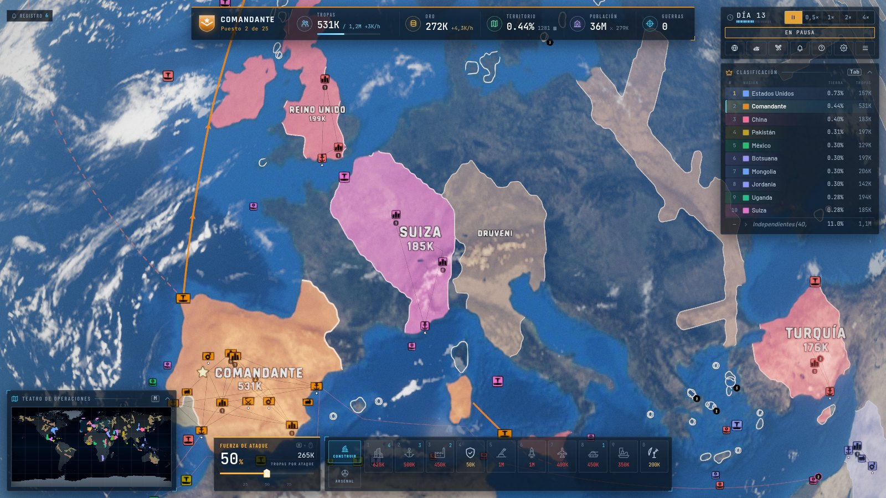

## Galería

| | |
|---|---|
| 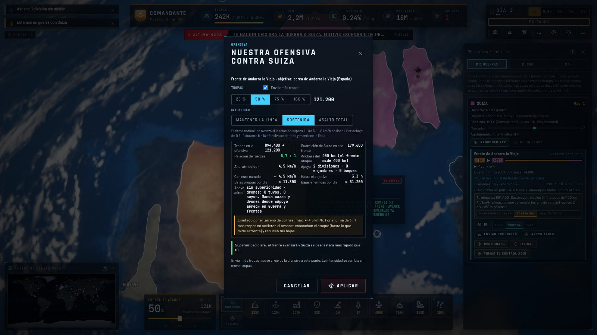 | 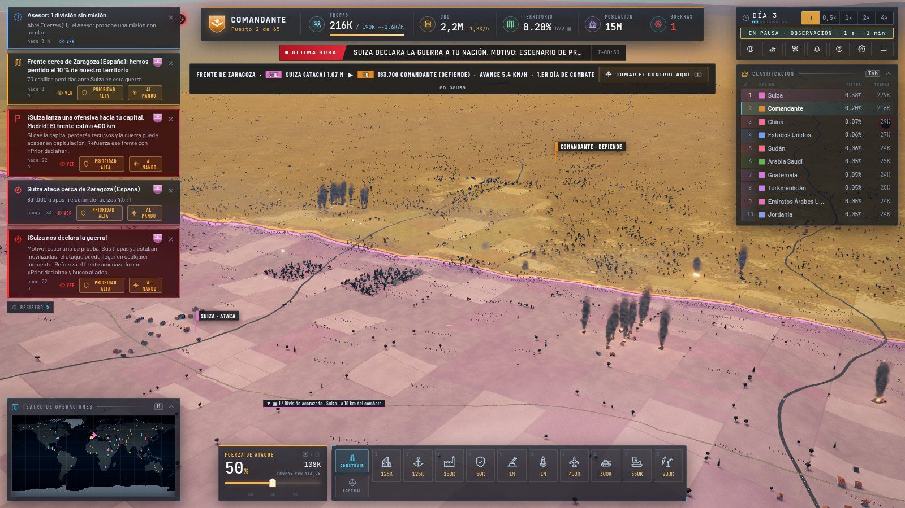 |
| **Ofensivas deliberadas.** Un clic abre el diálogo: tropas, intensidad, relación de fuerzas, km/h que permite el terreno, bajas y apoyo aéreo antes de confirmar. | **El frente de cerca.** Cada lado del campo en el color de su nación, la línea de contacto marcada, avisos que dicen dónde y qué hacer. |
| 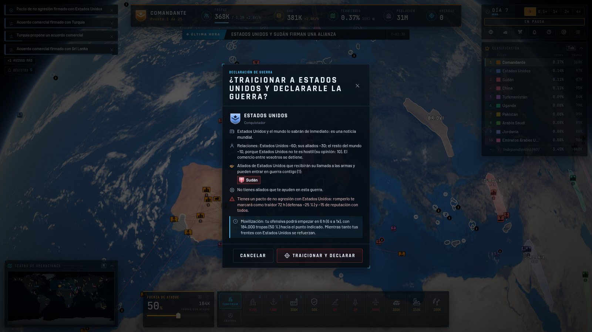 | 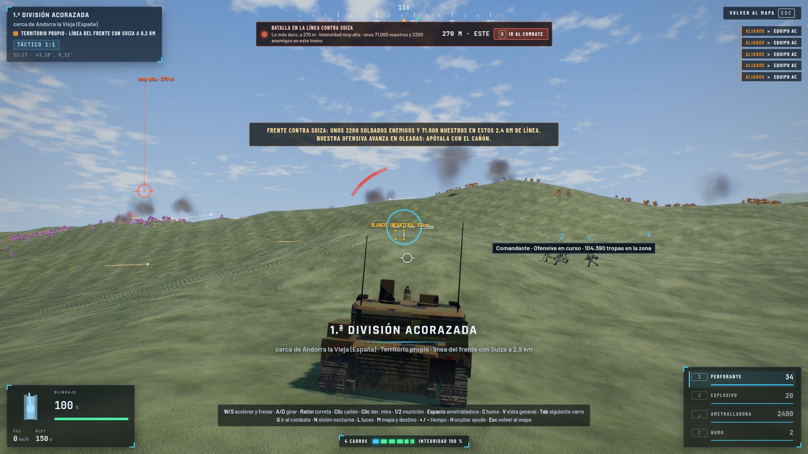 |
| **Diplomacia con consecuencias.** Declarar la guerra (o traicionar un pacto) dice quién se enterará, quién entrará en la guerra y cuánto tarda tu ofensiva en poder empezar. | **Modo mando.** Tomas el control de tu división donde está; «Ir al combate» te lleva al tramo más caliente de la línea, con cientos de soldados de ambos bandos. |
| 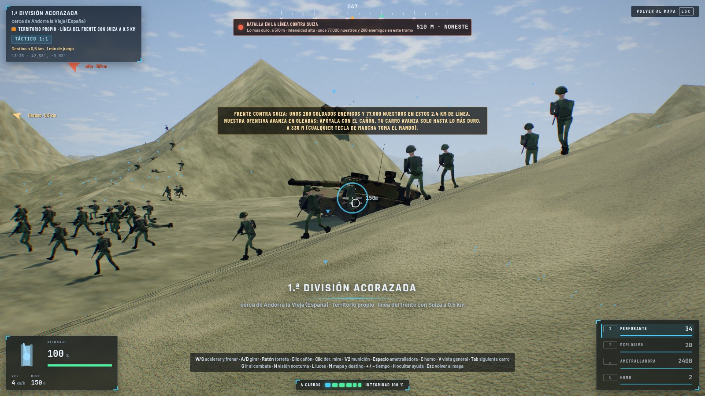 | 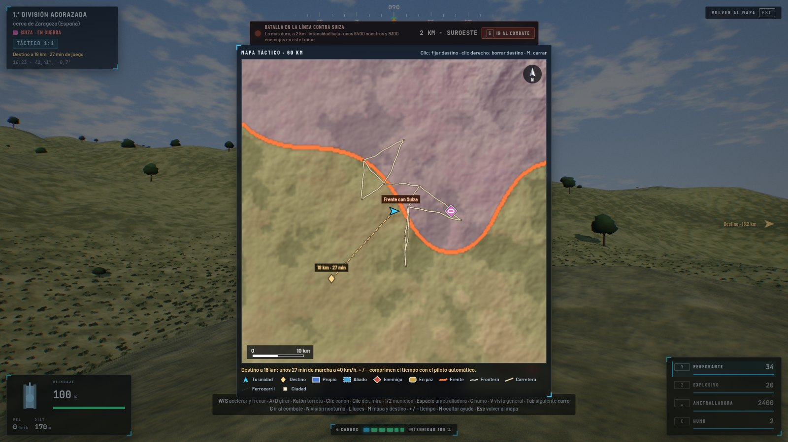 |
| **Soldados con equipo de campaña** y camuflaje en los tonos de su nación, animados (corren, se agachan, disparan, caen). | **Mapa táctico (M)** al estilo de un plano de estado mayor: relieve, fronteras, frente, carreteras, símbolos OTAN y destino con tiempo de marcha. |
| 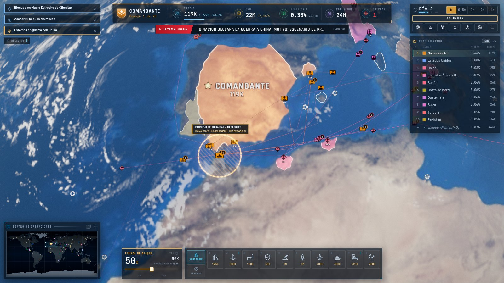 | 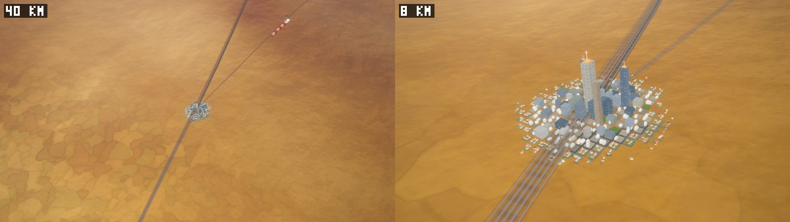 |
| **Guerra en el mar.** Bloqueos selectivos de puertos, rutas y estrechos (Gibraltar, Suez, Ormuz…), con ganancias y costes diplomáticos mostrados antes de confirmar. | **Modelos 3D de cerca, iconos de lejos.** Cada estructura se asienta en el terreno y cambia de forma al subir de nivel. |
| 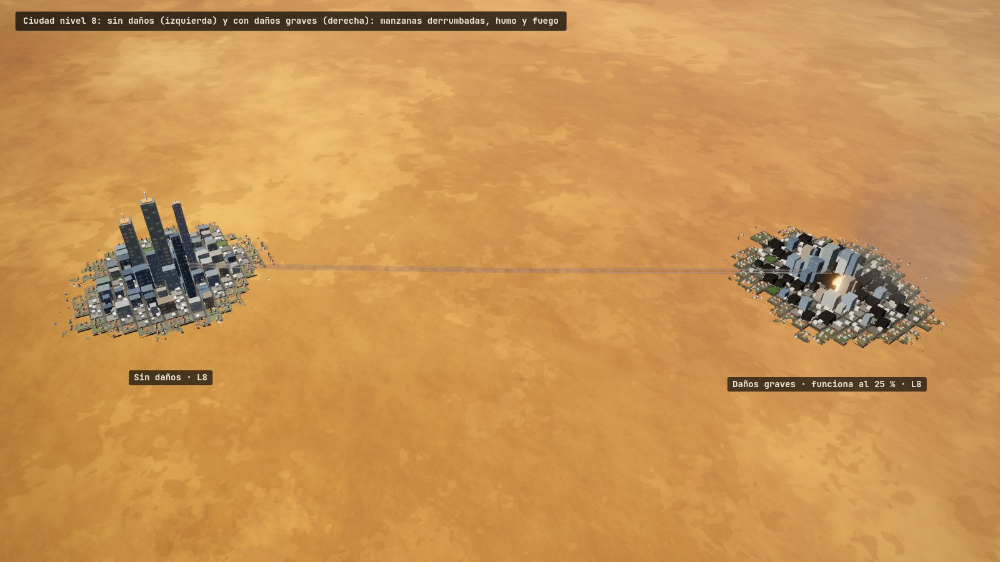 | 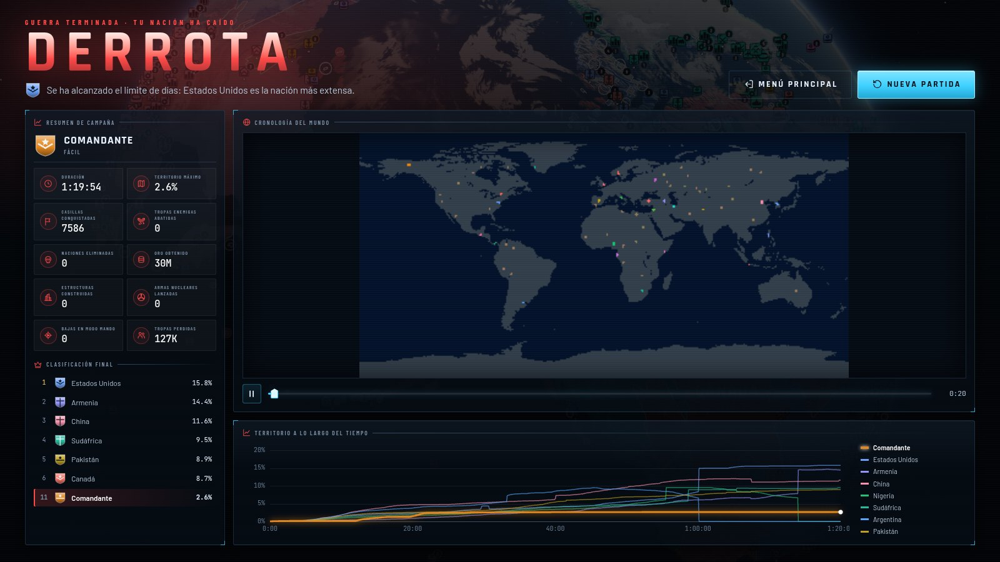 |
| **Daños reales.** La misma ciudad intacta y con daños graves: manzanas derrumbadas, humo y fuego, y funciona al 25 %. Las estructuras pierden nivel, quedan en ruinas y se reparan con oro. | **Fin de la partida** por dominio, hegemonía o límite de tiempo, con el resumen de la campaña. |

## Cómo ejecutarlo

Requisitos: Node.js 20.19 o superior (probado con Node 22) y un navegador con WebGL 2 (Chrome, Edge, Firefox o
Safari recientes; con tarjeta gráfica, el juego está pensado para 60 fps).

```bash
npm install          # dependencias (solo hace falta la primera vez)
npm run dev          # servidor de desarrollo en http://127.0.0.1:5173/
npm run build        # comprueba tipos y genera la versión de producción en dist/
npm run preview      # sirve dist/ en http://127.0.0.1:4173/
```

`dist/` es una web estática con rutas relativas: se puede publicar en cualquier subcarpeta de cualquier servidor
(por ejemplo `https://ejemplo.com/juegos/front-ultra/`). El juego no hace ninguna petición de red fuera de sus propios
archivos: sin CDN, sin fuentes externas, sin telemetría. Las partidas se guardan en el navegador (menú de pausa ›
Guardar; «Continuar» en el menú principal).

El idioma por defecto es el español; el inglés se elige en Ajustes.

## Controles

### Mapa estratégico

| Entrada | Acción |
|---|---|
| Arrastrar con el botón izquierdo · rueda | Girar el globo · acercar y alejar |
| Arrastrar con el botón derecho o central | Rumbo e inclinación de la cámara |
| Clic izquierdo en tierra | Según lo que haya: expandirte a tierra libre, lanzar o reforzar una ofensiva contra una nación en guerra contigo, abrir el diálogo de declaración de guerra (nación en paz), o una invasión naval. La ficha junto al cursor dice qué pasará antes de hacer clic |
| Clic en una unidad o su icono | Seleccionarla (Mayús + clic añade o quita; Mayús + arrastrar selecciona con un recuadro; doble clic, todas las de ese tipo en pantalla) |
| Clic derecho con unidades seleccionadas | Orden según el contexto (mover, unirse a una ofensiva, defender sector, patrulla aérea, escoltar, bombardear, bloquear…), con vista previa de efecto, riesgo y tiempo |
| Clic derecho sin selección | Menú radial de diplomacia sobre la nación bajo el cursor |
| `[` / `]` | Fuerza de ataque −5 % / +5 % (también la barra «Fuerza de ataque») |
| `1` … `0` | Construir: ciudad, puerto, fábrica, puesto defensivo, SAM, silo, base aérea, base del ejército, astillero, radar |
| `Z` `X` `C` `V` | Armas del silo: bomba atómica, bomba H, MIRV, misil de crucero (solo contra una nación con la que estés en guerra, y siempre con confirmación) |
| `B` | Invasión naval sobre una costa |
| `Espacio` | Pausa / continuar (en pausa puedes seguir dando órdenes) |
| `+` / `-` | Velocidad: 0,5×, 1×, 2×, 4× |
| `U` | Panel **Fuerzas**: cada unidad con su misión, estado, tiempo de llegada e integridad |
| `G` | Panel **Guerra y frentes** (pestañas Mis guerras, Mundo y Mar) |
| `N` | Panel **Naciones** y bandeja diplomática |
| `T` | Tomar el mando de la división, escuadrón o buque seleccionado |
| `I` | Siguiente unidad sin misión |
| `L` | Registro de avisos |
| `H` / `Inicio` | Volver a la capital |
| `M` · `Tab` | Mostrar u ocultar el minimapa · la clasificación |
| `Intro` | Menú radial sobre la nación bajo el cursor |
| `F1` / `?` | Ayuda y enciclopedia |
| `Esc` | Cancelar, cerrar el panel abierto y, si no hay nada, menú de pausa |

### Modo mando

Comunes: `G` ir al combate (o al frente más cercano) · `M` mapa táctico y destino del piloto automático · `+` / `−`
compresión del tiempo en viaje · `N` visión nocturna / térmica · `L` luces · `H` ocultar la ayuda · `Esc` volver al
mapa (la unidad se queda exactamente donde la dejas).

| Carro | Caza | Buque |
|---|---|---|
| `W` / `S` acelerar y frenar | Ratón: dirigir | `W` / `S` telégrafo de máquinas |
| `A` / `D` girar | `W` / `S` potencia (`Mayús` poscombustión) | `A` / `D` timón |
| Ratón: torreta | `A` / `D` alabeo · `Q` / `E` guiñada | Ratón: apuntar |
| Clic: cañón · clic derecho: mira | Clic: cañón · clic derecho: misil | Clic: cañón · clic derecho: misil antibuque |
| `1` / `2` munición perforante / explosiva | `B` bomba (4 por salida) | Ante un mercante: `E` dar el alto · `R` disparo de advertencia · `F` abordar · `X` hundir |
| `Espacio` ametralladora · `C` humo | `F` bengalas | `B` bloquear esta zona |
| `V` vista general · `Tab` siguiente carro | `Tab` siguiente caza | `Tab` siguiente buque |

Disparar contra algo de una nación con la que estás en paz **pregunta antes del disparo**; `Intro` y `Esc` siempre
significan «No disparar».

## Mecánicas

### El tiempo

Un solo reloj para todo: a **1× un segundo real es una hora de juego** (pausa, 0,5×, 1×, 2× y 4×). Una división
marcha a 40 km/h por carretera, un tren a 100 km/h, un buque de guerra a 55 km/h, un convoy de invasión a 35 km/h y
un frente avanza como mucho a 8 km/h. Los aviones vuelan a su velocidad media de misión (450 km/h los cazas) y dejan
su traza en el mapa. Hay tres relojes especiales:

* **Tiempo de observación**: con la cámara por debajo de ~70 km, el mundo entero pasa a 1 minuto de juego por segundo
  para que la batalla y los modelos se muevan a un ritmo creíble.
* **Tiempo de crisis**: mientras vuela un arma nuclear, el reloj se frena igual, a cualquier velocidad: el misil
  tarda sus minutos reales y tienes tiempo de ver venir el impacto.
* **Modo mando**: tiempo real (1:1) en contacto, y viaje acelerado (×10 a ×900) cuando no hay enemigos cerca.

La **pausa automática** (configurable) detiene el juego cuando te declaran la guerra, recibes un ultimátum, amenazan
tu capital o te lanzan un arma nuclear, y un aviso dice por qué y qué puedes hacer. Una partida Normal dura de 60 a
120 minutos a 1×; también hay partidas Cortas y Largas.

### Guerra y paz

* Con una nación en paz **no se puede atacar sin más**: hay que declararle la guerra en un diálogo que explica el
  motivo, la reacción del mundo, los aliados que entrarán en la guerra y el tiempo de movilización (6 h) antes de que
  tu ofensiva pueda empezar. Romper un pacto te marca como traidor.
* Una guerra abre **frentes** a lo largo de la frontera común. Cada frente tiene una guarnición por bando, que sube o
  baja con su prioridad (panel Guerra).
* Una **ofensiva** se lanza con una sola acción deliberada: eliges cuántas tropas y la intensidad (mantener la línea,
  sostenida, asalto total) y ves antes la relación de fuerzas, los km/h que permite el terreno, las bajas por día y el
  apoyo aéreo. Luego avanza sola, de forma progresiva y acotada, y se gestiona desde la insignia del frente o el panel
  Guerra (reforzar, cambiar la intensidad, detener, retirarse). Ni la nación más grande puede tragarse la tuya de un
  fotograma a otro: un frente avanza como mucho 8 km/h y siempre se ve dónde está el ataque.
* La relación de fuerzas manda: por debajo de 1:1 no se avanza; a partir de 5:1 sostenido una hora hay **ruptura** y
  la guarnición se rinde o huye. Montañas, bosques y ríos frenan.
* Las guerras terminan con **paz negociada** (paz blanca sobre la línea del frente, cesión de territorio o tributo), **capitulación** o
  eliminación. Gana quien llega a dominar la tierra o mantiene la **hegemonía** de su bloque durante días.
* **Misiles y bombardeos tienen sentido**: siguen una escalera de escalada (convencional, ataques a ciudades, nuclear),
  cada paso tiene un motivo que se anuncia, y atacar objetivos civiles cuesta opinión, da motivo de guerra a la víctima
  y a sus aliados y se confirma antes.

### Diplomacia

* Cada nación tiene una **opinión** de ti (con su desglose: vecindad, tratados, comercio, agravios, miedo) y una
  personalidad (conquistador, defensivo, comerciante, oportunista, belicista nuclear).
* Puedes proponer **pactos de no agresión, acuerdos comerciales, paso libre, alianzas, paz y tributos**, pedir ayuda a
  tus aliados o imponer embargos. La otra nación se toma su tiempo («estudiando…») y **responde con sus razones**.
* Las IA avisan antes de atacarte: tensión, exigencias y ultimátum con 48-72 h de juego de margen, y sus guerras
  siguen la geografía y un motivo. Un vecino más fuerte que empieza guerras hace que los demás se alíen contra él.
* Entrar sin permiso en tierra, aguas o espacio aéreo ajenos con una unidad es una **incursión**: aviso por radio con
  cuenta atrás y, si no te das la vuelta, la víctima envía fuerzas reales desde sus bases más cercanas.

### Unidades y estructuras

* **Estructuras** (todas con 3 niveles, y la ciudad hasta 10, que cambian el modelo y la función): ciudad (población,
  tropas, oro), puerto (comercio marítimo), fábrica (producción y ferrocarril), puesto defensivo, SAM, silo de
  misiles, base aérea, base del ejército, astillero y radar. Cada ficha dice qué hace, qué rinde ahora y qué rendirá
  al mejorarla. Pueden dañarse (funcionan peor), perder nivel, quedar en ruinas, repararse con oro y ser capturadas.
* **Unidades**: divisiones acorazadas, escuadrones de cazas, bombarderos, enjambres de drones y buques de guerra,
  además de trenes y mercantes. Cada una recibe **misiones reales** desde el panel Fuerzas, el clic derecho o el panel
  Guerra: atacar una zona, defender un sector o una ciudad, unirse a una ofensiva (que gana potencia y km/h, visible en
  su vista previa), patrulla aérea que intercepta incursiones, apoyo aéreo cercano, escolta, bombardeo de objetivos,
  asalto o arrasamiento de estructuras y **bloqueo** de puertos, rutas y estrechos. Las misiones siguen solas hasta
  cumplirse, gastan combustible y vuelven a rearmarse; al terminar llega un **informe** con resultado, bajas y daños.
  La IA usa las mismas misiones contra ti.
* **Guerra naval**: bloqueos selectivos (solo el enemigo, una lista de naciones, solo convoyes…), mercantes que se
  desvían por la ruta larga, buques apresados que pasan a tu bandera o hundidos, con el coste de la piratería
  mostrado antes de confirmar.
* Lejos, cada cosa es un **icono** claro (marco OTAN según tu relación: propio, aliado, en guerra, otros); de cerca, su
  **modelo 3D** bien asentado sobre el terreno.

### Modo mando

* Tomas el control de una unidad real (desde su ficha, la insignia de un frente, el panel Guerra, una batalla o un
  aviso) y apareces **donde está**: en paz, en tu territorio, puedes conducir de una punta del país a otra.
* «**Ir al combate**» (`G`) te lleva al punto más caliente de la línea; un indicador siempre visible dice dónde está la
  lucha, a qué distancia y con qué intensidad. Las batallas tienen la escala de las cifras del mapa: trincheras,
  oleadas, cientos de soldados, vehículos, artillería, humo y trazadoras.
* Lo que destruyes vuelve a la simulación: soldados, vehículos, estructuras y manzanas de ciudades. La ametralladora
  apenas araña un edificio (y el juego te lo dice); el cañón y las bombas sí. Atropellar y embestir hace daño, también
  al propio vehículo.
* Al salir, la unidad se queda donde la dejaste, y la cámara estratégica mira ese lugar.

### Todo explicado

Tutorial del Asesor militar, paso a paso y esperando siempre al jugador, ayuda (`F1`), enciclopedia con las tablas reales del
juego, tooltips con cifras en todos los controles, desgloses en la barra superior, avisos situados en el mapa y un
registro de todo lo ocurrido.

## Créditos

* Imágenes de la Tierra (Blue Marble, Black Marble, relieve, máscara de agua, nubes, cielo nocturno): **NASA**, dominio
  público, a través de los ejemplos del paquete `three-globe` (MIT).
* Formas y nombres de los países: **Natural Earth** (dominio público), a través del paquete `world-atlas`.
* Diseño **inspirado en OpenFront.io** (https://openfront.io). No se ha copiado ningún código ni recurso de OpenFront:
  se usó solo como referencia de mecánicas.
* Hecho con Three.js, TypeScript y Vite. Tipografías Rajdhani, Barlow, Barlow Condensed y JetBrains Mono (SIL OFL 1.1)
  empaquetadas con `@fontsource`. Todo lo demás (modelos, texturas procedurales, sonido) se genera por código.

Más detalle técnico: [ARCHITECTURE.md](ARCHITECTURE.md), [docs/DESIGN_V2.md](docs/DESIGN_V2.md) (el diseño con sus
cifras) y [docs/CODEMAP.md](docs/CODEMAP.md).
